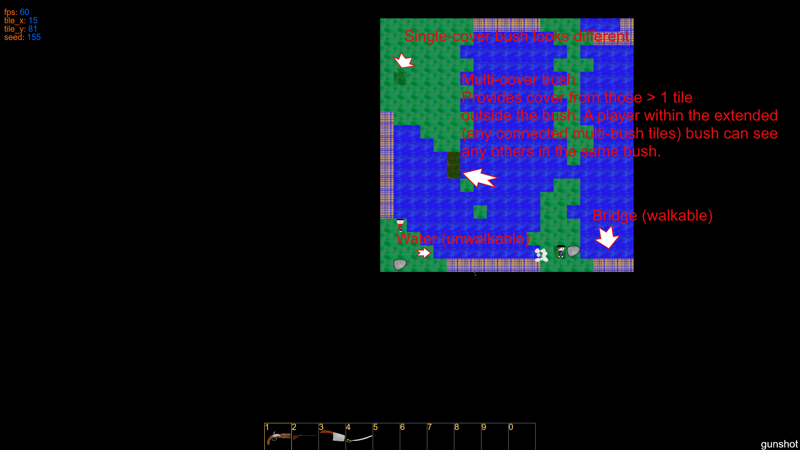
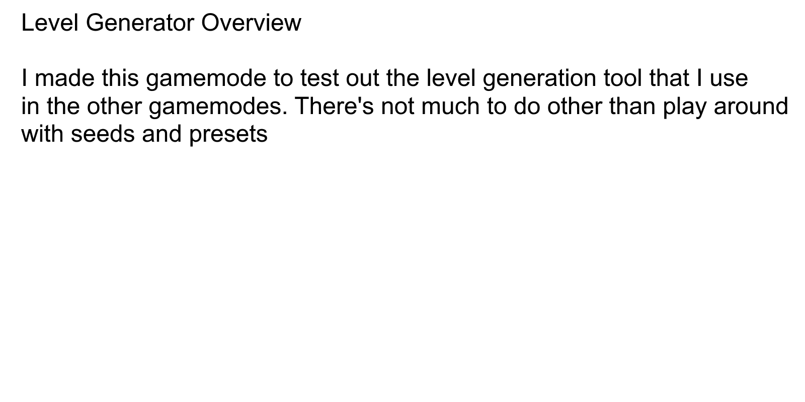

# Play the game
https://notsamj.github.io/WrathOfTheLobsters/

# Description
This is a tile based shooting-focused game made to run in a browser. For information about how to play, one can open the game and press 'H' on any menu/game.

# Demo
TODO

# Photo guide

## Main Menu

## Gamemode Viewer

## Sound Settings

## Extra Settings

## Duel Menu

## Duel

## Gentlemanly Duel Menu

## Gentlemanly Duel

## Level Generator Menu

## Level Generator

